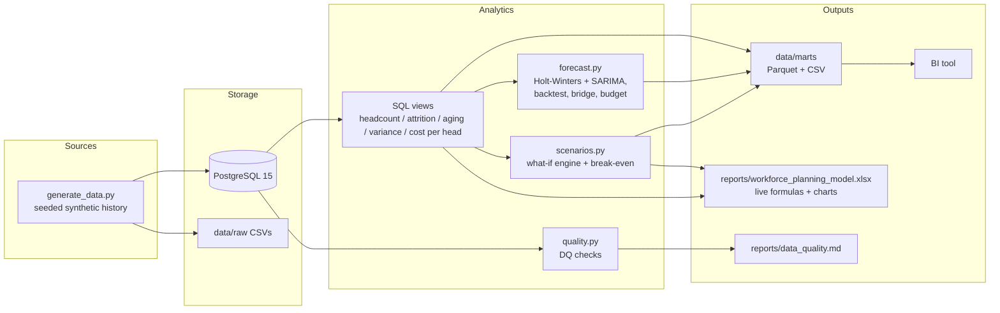

# Workforce Budget Planner

Headcount and operating-budget forecasting for a fictional multi-site semiconductor
manufacturing organization (Gresham OR, Roseville CA, Seremban MY, Brno CZ). The
project generates 36 months of seeded synthetic history, forecasts 12 months ahead
with two time-series methods, runs what-if scenarios with a break-even analysis, and
ships a stakeholder-ready Excel model — all with automated tests (96.6% coverage),
data quality gates, and CI.

## What the project does

- **Synthetic history** (`generate_data.py`): deterministic (`seed=42`) generation of
  ~2,800 active employees across 4 sites, realistic attrition (0.8–2.2%/month by site
  and job family), seasonal hiring ramps, requisitions with 30–90 day fill lags, and
  actual spend that deviates from plan by ±3–12%, including two injected anomalies
  (Seremban overtime overspend for 4 months; Brno Facilities chronically underspends
  non-labor).
- **SQL views** (`sql/views.sql`): monthly headcount by slice, attrition with 3-month
  rolling annualized rates, requisition aging with `PERCENTILE_CONT` time-to-fill,
  budget vs actual variance with YTD windows, and cost per head.
- **Forecasting** (`forecast.py`): Holt-Winters exponential smoothing and SARIMA with
  80%/95% confidence intervals; a walk-forward backtest picks the winning method per
  site; a supply/demand bridge (current − attrition + expected fills) and a labor
  budget translation using role salary bands.
- **Scenarios** (`scenarios.py`): hiring freeze, attrition spike (site- or
  job-family-targeted), overtime shift with premium and per-head hour caps,
  accelerated hiring — composable, with a numeric break-even vs backfill hiring.
- **Excel deliverable** (`excel_report.py`): `reports/workforce_planning_model.xlsx`
  with live formulas wired to named-range assumptions, conditional formatting, and
  native charts.
- **Data quality** (`quality.py`): post-seed checks with a pass/fail report at
  `reports/data_quality.md` and a non-zero exit code on failure.

## Architecture



## Quickstart

Prerequisites: Docker with Compose, Python 3.11.

```sh
# 1. Create a virtualenv and install pinned dependencies
uv venv --python 3.11 && uv pip install -r requirements.txt
# or: python3.11 -m venv .venv && .venv/bin/pip install -r requirements.txt

# 2. (Optional) copy .env.example to .env — defaults already match docker-compose
cp .env.example .env

# 3. Start PostgreSQL 15 (host port 5433, persistent volume)
make db-up

# 4. Generate and seed synthetic data (writes data/raw/*.csv and loads Postgres)
make seed

# 5. Run the analytics chain (views, forecasts, bridge, budget -> data/marts)
make analytics

# 6. Run scenario modeling + build the Excel workbook
make scenarios

# 7. Run post-seed data quality checks (exits non-zero on failure)
make quality
```

## Make targets

| Target        | What it does                                                        |
|---------------|---------------------------------------------------------------------|
| `make db-up`  | Start PostgreSQL 15 via Docker Compose (port 5433, named volume)    |
| `make db-down`| Stop the database container                                         |
| `make seed`   | Generate synthetic data, write `data/raw/*.csv`, load into Postgres |
| `make analytics` | Create views, run forecasts/backtests/bridge/budget, write marts |
| `make scenarios` | Run the scenario engine and build `reports/workforce_planning_model.xlsx` |
| `make quality` | Run data quality checks, write `reports/data_quality.md`, exit non-zero on failure |
| `make test`   | Run pytest                                                          |
| `make coverage` | Run pytest with coverage (fails under 80%)                        |
| `make lint`   | Run ruff                                                             |

## Data model

All parameters live in `config/params.yaml` — forecast horizon, seasonal period,
confidence levels, backtest windows, fringe rate, overtime premium/cap, and scenario
defaults. Nothing is hardcoded.

### Base tables (`sql/schema.sql`)

| Table | Columns | Keys / notes |
|---|---|---|
| `sites` | `site_id`, `site_name`, `region`, `country` | 4 sites: Gresham, Roseville, Seremban, Brno |
| `cost_centers` | `cost_center_id`, `site_id`, `cc_code`, `cc_name`, `function` | FK → sites; 6 functions × 4 sites = 24 CCs |
| `roles` | `role_id`, `role_name`, `job_family`, `salary_band`, `base_annual_usd` | 17 roles across 6 job families |
| `headcount_roster` | `employee_id`, `site_id`, `cost_center_id`, `role_id`, `shift` (ENUM A/B/C/Days), `hire_date`, `term_date` (nullable), `fte`, `annual_salary_usd` | FKs → sites/cost_centers/roles; partial index for active headcount |
| `requisitions` | `req_id`, `site_id`, `cost_center_id`, `role_id`, `opened_date`, `target_start_date`, `filled_date` (nullable), `status` (ENUM open/filled/cancelled/on_hold) | FKs → sites/cost_centers/roles |
| `budget_plan` | `cost_center_id`, `fiscal_month`, `planned_headcount`, `planned_labor_usd`, `planned_nonlabor_usd` | Composite PK (cost_center_id, fiscal_month); 36 months |
| `actual_spend` | `cost_center_id`, `fiscal_month`, `actual_labor_usd`, `actual_overtime_usd`, `actual_nonlabor_usd` | Composite PK (cost_center_id, fiscal_month); 36 months |

### Views (`sql/views.sql`)

| View | What it provides |
|---|---|
| `v_monthly_headcount` | Active headcount/FTE by site, cost center, role, shift, fiscal month (active = hired by month end AND not termed by month end) |
| `v_attrition` | Monthly terminations, average headcount, annualized rate, and 3-month rolling annualized rate by site and job family |
| `v_req_aging` | Open requisitions bucketed by days-open (0-30/31-60/61-90/90+) plus `PERCENTILE_CONT` median time-to-fill for filled reqs, by site |
| `v_budget_variance` | Plan vs actual by cost center and month with variance USD/% for labor, overtime, non-labor, and total, plus YTD cumulative variance via window functions |
| `v_cost_per_head` | Total actual spend ÷ average monthly headcount by site and month |

### Marts (`data/marts/`)

All analytics output lands in `data/marts/` as both Parquet and CSV:
view snapshots, site/site-family forecasts (both methods with CIs), headcount bridge,
budget forecast, backtest results/winners, scenario monthly/comparison/break-even.

## Variance sign convention

Variance is always **plan − actual**, so **overspend is negative** and shown as
unfavorable (red) everywhere — SQL views, scenario deltas (`baseline − scenario`, so
a costlier scenario is negative), the Excel variance columns, and conditional
formatting rules.

## Forecasting methodology

For each series (site level and site × job family), 12 months ahead:

1. **Holt-Winters** additive trend + additive seasonality (`seasonal_periods=12`),
   with residual-based intervals scaled by √h so CIs widen with horizon.
2. **SARIMA** `(1,0,1)(1,0,1,12)` with analytic prediction intervals when the
   Hessian is well-conditioned, falling back to the same √h residual intervals.
3. **Walk-forward backtest** over the last 6 months (1-step-ahead), scoring MAPE and
   RMSE per method per site; the winner is applied to that site's forecasts and the
   labor budget translation.

Backtest results (36 months of history, last 6 months walk-forward):

| Site      | HW MAPE % | HW RMSE | SARIMA MAPE % | SARIMA RMSE | Winner       |
|-----------|-----------|---------|---------------|-------------|--------------|
| Gresham   | 0.89      | 10.49   | 1.15          | 12.52       | Holt-Winters |
| Roseville | 0.24      | 2.73    | 0.19          | 1.69        | SARIMA       |
| Seremban  | 0.44      | 3.87    | 0.67          | 5.77        | Holt-Winters |
| Brno      | 0.37      | 1.66    | 0.36          | 1.79        | SARIMA       |

The supply/demand bridge projects `current_active − forecast_attrition +
expected_req_fills`, where expected fills use historical role-level fill rates and
median time-to-fill. `forecast_budget` converts headcount into labor dollars using
role salary bands, a fringe rate (0.28), and an overtime assumption (5%).

## Scenarios and break-even

Declarative scenarios (`Scenario` dataclass; `compose()` combines them), each
returning the same canonical monthly schema as the baseline:

| Scenario | Behavior |
|---|---|
| `hiring_freeze(start_month, sites)` | No requisition fills after `start_month`; attrition continues |
| `attrition_spike(multiplier, months, job_family)` | Multiplies attrition for N months, optionally only for one job family |
| `overtime_shift(ot_hours_per_head, premium, cap)` | Freezes hiring and covers the headcount gap with overtime at a premium, capped per employee-month |
| `accelerated_hiring(extra_reqs_per_month, ramp_cost_per_hire)` | Extra fills per site per month with one-time ramp cost |

Latest run (Δ vs baseline, positive = cheaper):

| Scenario | Δ total cost | Δ % |
|---|---|---|
| Hiring freeze | +$0.96M | +0.44% |
| Attrition spike (1.75×, 6 mo) | +$9.93M | +4.53% |
| Overtime shift (160 h, 1.5× premium) | −$0.03M | −0.01% |
| Accelerated hiring (5 reqs/site/mo) | −$11.66M | −5.32% |
| Spike + freeze (composed) | +$10.86M | +4.95% |
| Attrition spike, Fab Operations only | +$4.79M | +2.18% |

Break-even (answered numerically by `run_scenarios()`): under current assumptions the
overtime policy already exceeds backfill hiring at multiplier 1.0 — and per unit,
overtime equals backfill at ~157 OT hours per head-month (1.5× premium, 28% fringe,
$5k hire cost amortized over 12 months). The full multiplier grid is printed and
stored in `data/marts/scenario_break_even.*`.

## Excel deliverable

`reports/workforce_planning_model.xlsx` contains:

- **Assumptions** — named ranges (`fringe_rate`, `ot_premium`, `attrition_multiplier`,
  `hire_cost`, …). Edit a value and the whole model recalculates.
- **Headcount_Forecast** — site × month with live labor/overtime formulas.
- **Scenarios** — recursive monthly model with live formulas per scenario, a
  comparison table with red/green conditional formatting, the break-even section,
  and a native line chart of baseline vs scenario headcount.
- **Budget_Variance** — 864 history rows with formula-driven variance USD/%,
  red (> +5% overspend) / green formatting, a SUMIFS cost-center summary, and a
  clustered bar chart of variance by cost center. Freeze panes and autofilters
  throughout.

## Data quality

`make quality` (also run in CI) checks that: no `term_date` precedes `hire_date`;
every cost center with active headcount has a budget; no duplicate
(cost center, month) rows; no negative spend; and the plan covers the full 36-month
history horizon for every cost center. Results are written to
`reports/data_quality.md` and the process exits non-zero on any failure.

## Development

```sh
make test      # 56 tests: unit, SQL-view (transient Postgres), integration
make coverage  # >= 80% required (currently 96.6%)
make lint      # ruff
```

Tests cover: forecast accuracy on synthetic trend/seasonal series, CI widening,
backtest MAPE bounds, every scenario (freeze monotonicity, spike ×1.0 ≡ baseline,
premium scaling), hand-computed SQL view fixtures including active-in-month boundary
cases (hired mid-month, termed mid-month, `term_date` == month end), variance sign
conventions, data quality checks, and end-to-end pipelines. Postgres-dependent tests
run against a transient `wbp_test` database or skip when no database is available.

CI (`.github/workflows/ci.yml`) spins up a PostgreSQL 15 service container, lints,
seeds, runs quality checks, runs pytest with coverage (fails under 80%), and uploads
the coverage report.

## Screenshots

Placeholders — drop captures here and reference them:

- `docs/screenshots/excel_assumptions.png` — Assumptions sheet with named ranges
- `docs/screenshots/excel_scenarios.png` — scenario model and headcount chart
- `docs/screenshots/excel_variance.png` — Budget_Variance with conditional formatting
- `docs/screenshots/bi_dashboard.png` — BI dashboard built on `data/marts/`
